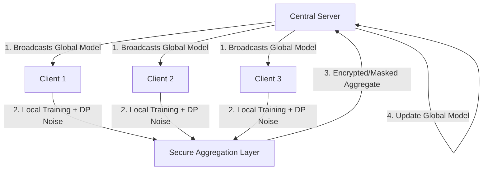

# 🔐 Privacy-Preserving Machine Learning Framework

A robust, end-to-end Federated Learning (FL) framework integrated with Differential Privacy (DP) and Secure Aggregation simulation. Designed for healthcare, finance, and cybersecurity applications where data privacy is paramount.

## 🌟 Key Features

- **Federated Learning Simulation**: Orchestrates training across multiple simulated clients (minimum 5) using the FedAvg algorithm.
- **Differential Privacy (DP)**: Implements gradient clipping and Gaussian noise injection to protect individual data points from inference attacks.
- **Secure Model Aggregation**: Simulates secure summation to ensure the central server only accesses the aggregate model update, never raw client weights.
- **Healthcare/Frauds Dataset Integrated**: Pre-configured to use the Breast Cancer Wisconsin (Diagnostic) dataset or Credit Card Fraud data for classification tasks.
- **Interactive Dashboard**: A FastAPI-powered web interface for real-time visualization of model performance and privacy metrics.

## 🏗 Architecture



1. **Server Initialization**: The central server initializes a global model (Logistic Regression or simple Neural Net).
2. **Local Training**: Clients download the global weights and train on their local, private datasets.
3. **Differential Privacy**: Before sharing updates, clients clip gradients and add Gaussian noise defined by `epsilon` and `delta` privacy budgets.
4. **Secure Aggregation**: Model updates are combined in a way that protects individual client contributions.
5. **Evaluation**: The global model is updated and evaluated on a centralized test set.

## 📂 Project Structure

- `client/`: Local training logic and data loaders.
- `server/`: Federated orchestration and model aggregation logic.
- `privacy/`: Implementation of Differential Privacy and Secure Aggregation.
- `models/`: PyTorch model definitions.
- `data/`: Dataset preprocessing and partitioning scripts.
- `api/`: FastAPI dashboard and system endpoints.
- `utils/`: Configuration management and logging.
- `main.py`: Entry point for CLI-based Federated experiments.

## 🚀 Getting Started

### 1. Prerequisites
- Python 3.8+
- PyTorch
- FastAPI / Uvicorn

### 2. Installation
```bash
# Clone the repository
git clone https://github.com/yourusername/privacy_ml_framework.git
cd privacy_ml_framework

# Install dependencies
pip install -r requirements.txt
```

### 3. Running the Framework

#### A. Command Line Simulation
Run the standard federated training process (5 clients, 10 rounds):
```bash
python main.py
```
To run without Differential Privacy (for comparison):
```bash
python main.py --no-privacy
```

#### B. Web Dashboard
Launch the FastAPI server to visualize training:
```bash
python -m api.dashboard_api
```
1. Open [http://127.0.0.1:8000/train](http://127.0.0.1:8000/train) to start the simulation.
2. Open [http://127.0.0.1:8000/dashboard](http://127.0.0.1:8000/dashboard) to view interactive charts.

## 📊 Expected Results
- **Accuracy Improvement**: The global model should converge over training rounds despite the added DP noise.
- **Privacy-Accuracy Tradeoff**: You will notice that higher noise levels (more privacy) slightly slow down or reduce peak accuracy compared to non-private runs.

## 🔮 Future Improvements
- [ ] Integration with PySyft for full homomorphic encryption support.
- [ ] Support for non-IID (Independent and Identically Distributed) data partitioning.
- [ ] Enhanced Secure Multi-Party Computation (SMPC) protocols.
- [ ] Support for Vision Transformers and Large Language Models.

## 🛡 License
MIT License. Created for the Privacy-Preserving ML Community.
